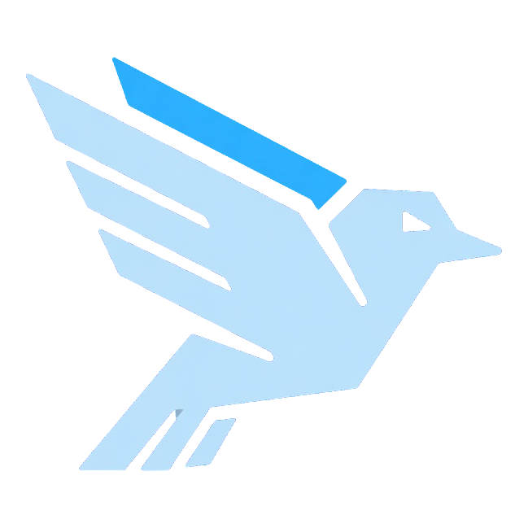

# Ronami

<p align="center">
  
</p>

<p align="center">
  Full-featured, elegant Telegram Bot framework in Rust with Bot API 9.5+ coverage.
</p>

<p align="center">
  <a href="https://github.com/ZethRise/Ronami/stargazers"></a>
  <a href="https://core.telegram.org/bots/api"></a>
  <a href="https://crates.io/crates/ronami"></a>
  <a href="https://docs.rs/ronami"></a>
  <a href="LICENSE"></a>
</p>

> **v1.0.0** — Ronami is a modern Telegram Bot framework in Rust, evolved from [teloxide](https://github.com/teloxide/teloxide) to deliver up-to-date Telegram Bot API 9.5+ coverage, refreshed crate naming, and active maintenance.

## What Ronami does

Ronami manages the full lifecycle of Telegram bot applications. It combines strongly-typed request and response structures with a declarative dependency-injection dispatcher (`dptree`), stateful conversational dialogues, resilient network adaptors, and macro-driven command routing.

```text
Telegram Bot API Server (:8081 / cloud)
                 │
                 ▼
       Ronami Core (HTTP / Multipart)
                 │
                 ▼
    Adaptors (Throttle / Trace / ParseMode / Erased)
                 │
                 ▼
         Dispatcher (dptree DI)
                 │
                 ▼
       Your Bot Handlers & Dialogues
```

## Highlights

- **Telegram Bot API 9.5+**: Full coverage including chat member tags (`setChatMemberTag`, `sender_tag`, `can_manage_tags`, `can_edit_tag`), `date_time` message entities, message draft streaming (`sendMessageDraft`), private chat forum topics, button custom emoji & colors (`ButtonStyle`), video qualities (`VideoQuality`), profile audios (`getUserProfileAudios`), unique gift craft/burn flags, and profile photo management.
- **Declarative Dispatching**: Functional chain-of-responsibility routing powered by `dptree`. Inject dependencies, compose pipelines, and cleanly isolate event handlers.
- **Stateful Dialogues**: Built-in finite-state-machine (FSM) conversations with interchangeable storage backends: In-Memory, Redis, SQLite, and PostgreSQL.
- **Pluggable Adaptor Stack**: Layer decorators for automatic request throttling, default parse modes (HTML / MarkdownV2), structured trace logging, and cache tiers.
- **Macro-Driven Commands**: Parse and dispatch bot command menus declaratively with `#[derive(BotCommands)]`.
- **Local & Cloud Bot API**: Seamlessly configure official cloud endpoints or self-hosted Bot API servers (e.g. `http://127.0.0.1:8081`).

## Quick start

### Requirements

- Rust 1.85+ (`stable` or `nightly`)
- A Telegram bot token from [@BotFather](https://t.me/botfather)

### Add dependency

Add Ronami to your `Cargo.toml`:

```toml
[dependencies]
ronami = { version = "1.0.0", features = ["macros"] }
tokio = { version = "1.47", features = ["rt-multi-thread", "macros"] }
log = "0.4"
pretty_env_logger = "0.5"
```

### Write your bot

Set your token:

```bash
export RONAMI_TOKEN="123456789:ABCdefGhIJKlmNoPQRsTUVwxyZ"
```

Create `src/main.rs`:

```rust
use ronami::prelude::*;

#[tokio::main]
async fn main() {
    pretty_env_logger::init();
    log::info!("Starting dice bot...");

    let bot = Bot::from_env();

    ronami::repl(bot, |bot: Bot, msg: Message| async move {
        bot.send_dice(msg.chat.id).await?;
        Ok(())
    })
    .await;
}
```

Run with `cargo run`.

## Command routing

Define typed command enums with doc comments automatically converted into Telegram help descriptions:

```rust
use ronami::{prelude::*, utils::command::BotCommands};

#[derive(BotCommands, Clone)]
#[command(rename_rule = "lowercase", description = "These commands are supported:")]
enum Command {
    #[command(description = "Display this help text.")]
    Help,
    #[command(description = "Handle a username.")]
    Username(String),
    #[command(description = "Handle a username and age.", parse_with = "split")]
    UsernameAndAge { username: String, age: u8 },
}

async fn answer(bot: Bot, msg: Message, cmd: Command) -> ResponseResult<()> {
    match cmd {
        Command::Help => {
            bot.send_message(msg.chat.id, Command::descriptions().to_string()).await?;
        }
        Command::Username(username) => {
            bot.send_message(msg.chat.id, format!("Username: @{username}")).await?;
        }
        Command::UsernameAndAge { username, age } => {
            bot.send_message(msg.chat.id, format!("User @{username}, Age: {age}")).await?;
        }
    }
    Ok(())
}

#[tokio::main]
async fn main() {
    pretty_env_logger::init();
    let bot = Bot::from_env();
    Command::repl(bot, answer).await;
}
```

## Migration from teloxide

Ronami is an API-compatible drop-in successor to teloxide. Rename dependencies and environment variables:

| Component | Teloxide | Ronami |
| --- | --- | --- |
| Framework crate | `teloxide` | `ronami` |
| Client core | `teloxide-core` | `ronami-core` |
| Macros | `teloxide-macros` | `ronami-macros` |
| Bot token | `TELOXIDE_TOKEN` | `RONAMI_TOKEN` |
| Custom API URL | `TELOXIDE_API_URL` | `RONAMI_API_URL` |
| Proxy | `TELOXIDE_PROXY` | `RONAMI_PROXY` |
| Dialogue table | `teloxide_dialogues` | `ronami_dialogues` |
| Coverage | 9.2 | **9.5+** |

See [MIGRATION_GUIDE.md](MIGRATION_GUIDE.md) for full details.

## Project layout

```text
crates/ronami/          High-level framework: dispatching, repls, dialogues
crates/ronami-core/     Core Bot API client, types, payloads, and adaptors
crates/ronami-macros/   Procedural macros for derive(BotCommands)
examples/               Production-ready bot examples and patterns
media/                  Brand assets and diagrams
```

## Contributing

Read [CONTRIBUTING.md](CONTRIBUTING.md) before opening a pull request. Bug reports and feature suggestions are welcome via [Issues](https://github.com/ZethRise/Ronami/issues).

## Security

Do not report security-sensitive issues or vulnerabilities in public issues. Send private reports to `ZethRise@proton.me`.

## License

Ronami is licensed under the [MIT License](LICENSE).

## Credits

- [teloxide](https://github.com/teloxide/teloxide) — original framework architecture.
- [dptree](https://github.com/teloxide/dptree) — dependency-injection handler tree.
- Maintained by [ZethRise](https://github.com/ZethRise).
