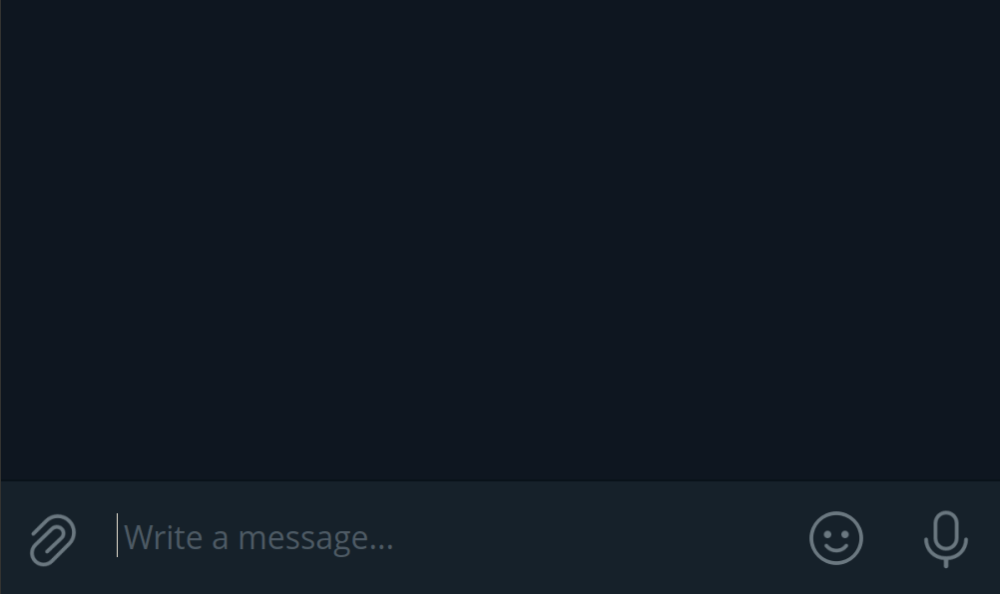
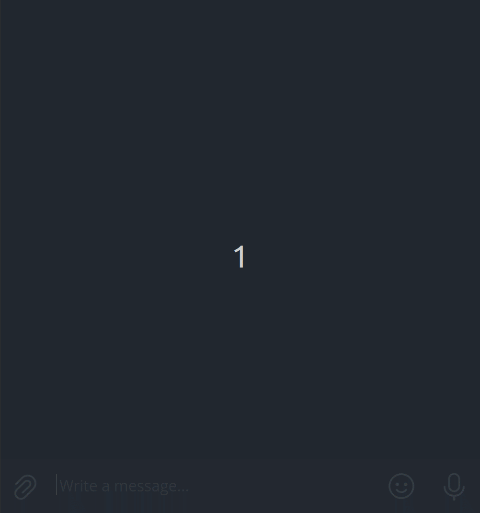

<div align="center">
  
  <h1><code>ronami</code></h1>
  <a href="https://github.com/ZethRise/Ronami">
    
  </a>
  <a href="https://docs.rs/ronami/">
    
  </a>
  <a href="https://crates.io/crates/ronami">
    
  </a>
  <a href="https://core.telegram.org/bots/api">
    
  </a>

  A full-featured framework for building [Telegram bots](https://telegram.org/blog/bot-revolution) in [Rust](https://www.rust-lang.org/). It handles the difficult stuff so you can focus on business logic.
</div>

## Fork of teloxide

**Ronami is a fork of [teloxide](https://github.com/teloxide/teloxide).**

This repository lives at [github.com/ZethRise/Ronami](https://github.com/ZethRise/Ronami). The original project is [github.com/teloxide/teloxide](https://github.com/teloxide/teloxide). Ronami keeps teloxide's architecture (typed Bot API client, `dptree` dispatching, dialogues, macros) under new crate names (`ronami`, `ronami-core`, `ronami-macros`) and is catching Telegram Bot API coverage up past teloxide's 9.2.

Use `RONAMI_TOKEN` instead of `TELOXIDE_TOKEN`. See [MIGRATION_GUIDE.md](MIGRATION_GUIDE.md) for the rest of the rename.

## Highlights

 - **Declarative design.** `ronami` is based upon [`dptree`], a functional [chain of responsibility] pattern that allows you to express pipelines of message processing in a highly declarative and extensible style.

[`dptree`]: https://github.com/teloxide/dptree
[chain of responsibility]: https://en.wikipedia.org/wiki/Chain-of-responsibility_pattern

 - **Feature-rich.** You can use both long polling and webhooks, configure an underlying HTTPS client, set a custom URL of a Telegram API server, do graceful shutdown, and much more.

 - **Simple dialogues.** Our dialogues subsystem is simple and easy-to-use, and, furthermore, is agnostic of how/where dialogues are stored. For example, you can simply replace one line to achieve [persistence]. Out-of-the-box storages include [Redis] and [Sqlite].

[persistence]: https://en.wikipedia.org/wiki/Persistence_(computer_science)
[Redis]: https://redis.io/
[Sqlite]: https://www.sqlite.org

 - **Strongly typed commands.** Define bot commands as an `enum` and `ronami` will parse them automatically — just like JSON structures in [`serde-json`] and command-line arguments in [`structopt`].

[`structopt`]: https://github.com/TeXitoi/structopt
[`serde-json`]: https://github.com/serde-rs/json

## Setting up your environment

 1. [Download Rust](http://rustup.rs/).
 2. Create a new bot using [@Botfather](https://t.me/botfather) to get a token in the format `123456789:blablabla`.
 3. Initialise the `RONAMI_TOKEN` environmental variable to your token:
```bash
# Unix-like
$ export RONAMI_TOKEN=<Your token here>

# Windows command line
$ set RONAMI_TOKEN=<Your token here>

# Windows PowerShell
$ $env:RONAMI_TOKEN=<Your token here>
```

 4. Make sure that your Rust compiler is up to date (`ronami` currently requires rustc at least version 1.85):
```bash
# If you're using stable
$ rustup update stable
$ rustup override set stable

# If you're using nightly
$ rustup update nightly
$ rustup override set nightly
```

 5. Run `cargo new my_bot`, enter the directory and put these lines into your `Cargo.toml`:
```toml
[dependencies]
ronami = { version = "1.0.0", features = ["macros"] }
log = "0.4"
pretty_env_logger = "0.5"
tokio = { version =  "1.39", features = ["rt-multi-thread", "macros"] }
```

_Note: before a crates.io release, depend on git:_

```toml
ronami = { git = "https://github.com/ZethRise/Ronami.git", features = ["macros"] }
```

## API overview

### The dices bot

This bot replies with a dice to each received message:

[[`examples/throw_dice.rs`](crates/ronami/examples/throw_dice.rs)]

```rust,no_run
use ronami::prelude::*;

#[tokio::main]
async fn main() {
    pretty_env_logger::init();
    log::info!("Starting throw dice bot...");

    let bot = Bot::from_env();

    ronami::repl(bot, |bot: Bot, msg: Message| async move {
        bot.send_dice(msg.chat.id).await?;
        Ok(())
    })
    .await;
}
```

<div align="center">
    
</div>

### Commands

Commands are strongly typed and defined declaratively, similar to how we define CLI using [structopt] and JSON structures in [serde-json]. The following bot accepts these commands:

 - `/username <your username>`
 - `/usernameandage <your username> <your age>`
 - `/help`

[structopt]: https://docs.rs/structopt/0.3.9/structopt/
[serde-json]: https://github.com/serde-rs/json

[[`examples/command.rs`](crates/ronami/examples/command.rs)]

```rust,no_run
use ronami::{prelude::*, utils::command::BotCommands};

#[tokio::main]
async fn main() {
    pretty_env_logger::init();
    log::info!("Starting command bot...");

    let bot = Bot::from_env();

    Command::repl(bot, answer).await;
}

#[derive(BotCommands, Clone)]
#[command(rename_rule = "lowercase", description = "These commands are supported:")]
enum Command {
    #[command(description = "display this text.")]
    Help,
    #[command(description = "handle a username.")]
    Username(String),
    #[command(description = "handle a username and an age.", parse_with = "split")]
    UsernameAndAge { username: String, age: u8 },
}

async fn answer(bot: Bot, msg: Message, cmd: Command) -> ResponseResult<()> {
    match cmd {
        Command::Help => bot.send_message(msg.chat.id, Command::descriptions().to_string()).await?,
        Command::Username(username) => {
            bot.send_message(msg.chat.id, format!("Your username is @{username}.")).await?
        }
        Command::UsernameAndAge { username, age } => {
            bot.send_message(msg.chat.id, format!("Your username is @{username} and age is {age}."))
                .await?
        }
    };

    Ok(())
}
```

<div align="center">
    
</div>

### Dialogues management

A dialogue is typically described by an enumeration where each variant is one possible state of the dialogue. There are also _state handler functions_, which may turn a dialogue from one state to another, thereby forming an [FSM].

[FSM]: https://en.wikipedia.org/wiki/Finite-state_machine

Below is a bot that asks you three questions and then sends the answers back to you:

[[`examples/dialogue.rs`](crates/ronami/examples/dialogue.rs)]

```rust,ignore
use ronami::{dispatching::dialogue::InMemStorage, prelude::*};

type MyDialogue = Dialogue<State, InMemStorage<State>>;
type HandlerResult = Result<(), Box<dyn std::error::Error + Send + Sync>>;

#[derive(Clone, Default)]
pub enum State {
    #[default]
    Start,
    ReceiveFullName,
    ReceiveAge {
        full_name: String,
    },
    ReceiveLocation {
        full_name: String,
        age: u8,
    },
}

#[tokio::main]
async fn main() {
    pretty_env_logger::init();
    log::info!("Starting dialogue bot...");

    let bot = Bot::from_env();

    Dispatcher::builder(
        bot,
        Update::filter_message()
            .enter_dialogue::<Message, InMemStorage<State>, State>()
            .branch(dptree::case![State::Start].endpoint(start))
            .branch(dptree::case![State::ReceiveFullName].endpoint(receive_full_name))
            .branch(dptree::case![State::ReceiveAge { full_name }].endpoint(receive_age))
            .branch(
                dptree::case![State::ReceiveLocation { full_name, age }].endpoint(receive_location),
            ),
    )
    .dependencies(dptree::deps![InMemStorage::<State>::new()])
    .enable_ctrlc_handler()
    .build()
    .dispatch()
    .await;
}

async fn start(bot: Bot, dialogue: MyDialogue, msg: Message) -> HandlerResult {
    bot.send_message(msg.chat.id, "Let's start! What's your full name?").await?;
    dialogue.update(State::ReceiveFullName).await?;
    Ok(())
}

async fn receive_full_name(bot: Bot, dialogue: MyDialogue, msg: Message) -> HandlerResult {
    match msg.text() {
        Some(text) => {
            bot.send_message(msg.chat.id, "How old are you?").await?;
            dialogue.update(State::ReceiveAge { full_name: text.into() }).await?;
        }
        None => {
            bot.send_message(msg.chat.id, "Send me plain text.").await?;
        }
    }

    Ok(())
}

async fn receive_age(
    bot: Bot,
    dialogue: MyDialogue,
    full_name: String, // Available from `State::ReceiveAge`.
    msg: Message,
) -> HandlerResult {
    match msg.text().map(|text| text.parse::<u8>()) {
        Some(Ok(age)) => {
            bot.send_message(msg.chat.id, "What's your location?").await?;
            dialogue.update(State::ReceiveLocation { full_name, age }).await?;
        }
        _ => {
            bot.send_message(msg.chat.id, "Send me a number.").await?;
        }
    }

    Ok(())
}

async fn receive_location(
    bot: Bot,
    dialogue: MyDialogue,
    (full_name, age): (String, u8), // Available from `State::ReceiveLocation`.
    msg: Message,
) -> HandlerResult {
    match msg.text() {
        Some(location) => {
            let report = format!("Full name: {full_name}\nAge: {age}\nLocation: {location}");
            bot.send_message(msg.chat.id, report).await?;
            dialogue.exit().await?;
        }
        None => {
            bot.send_message(msg.chat.id, "Send me plain text.").await?;
        }
    }

    Ok(())
}
```

<div align="center">
    
</div>

[More examples >>](crates/ronami/examples/)

## Testing

Upstream teloxide has a community test helper, [`teloxide_tests`](https://github.com/LasterAlex/teloxide_tests). It still targets the teloxide crate names and will not work with Ronami until it is forked or updated.

## Tutorials

 - [_`dptree` starter guide_](DPTREE_GUIDE.md)

## FAQ

**Q: Where can I ask questions?**

A: Open an issue on this repository. Ronami does not yet have a dedicated Telegram support chat.

**Q: Do you support the Telegram API for clients?**

A: No, only the bots API.

**Q: Can I use webhooks?**

A: You can! `ronami` has a built-in support for webhooks in `dispatching::update_listeners::webhooks` module. See how it's used in [`examples/ngrok_ping_pong_bot.rs`](crates/ronami/examples/ngrok_ping_pong.rs) and [`examples/heroku_ping_pong_bot.rs`](crates/ronami/examples/heroku_ping_pong.rs).

**Q: Can I handle both callback queries and messages within a single dialogue?**

A: Yes, see [`examples/purchase.rs`](crates/ronami/examples/purchase.rs).

**Q: How can I organize complex logic?**

A: You can use [`CommonVoiceBot`] as an example of a bot with a nested dialogue structure distributed across different files.

[`CommonVoiceBot`]: https://gitlab.com/alenpaulvarghese/commonvoicebot

**Q: Where can I find a WebApp example?**

A: Check out [@TheAwiteb]'s [WebApp `ronami` example].

[@TheAwiteb]: https://github.com/TheAwiteb
[WebApp `ronami` example]: https://gist.github.com/TheAwiteb/8d809b34b619b01e64453bb31dbd8bf4

## Community bots

Feel free to propose your own bot to our collection!

 - [`raine/tgreddit`](https://github.com/raine/tgreddit) — A bot that sends the top posts of your favorite subreddits to Telegram.
 - [`magnickolas/remindee-bot`](https://github.com/magnickolas/remindee-bot) — Telegram bot for managing reminders.
 - [`WaffleLapkin/crate_upd_bot`](https://github.com/WaffleLapkin/crate_upd_bot) — A bot that notifies about crate updates.
 - [`mattrighetti/GroupActivityBot`](https://github.com/mattrighetti/group-activity-bot-rs) — Telegram bot that keeps track of user activity in groups.
 - [`alenpaul2001/AurSearchBot`](https://gitlab.com/alenpaul2001/aursearchbot) — Telegram bot for searching in Arch User Repository (AUR).
 - [`ArtHome12/vzmuinebot`](https://github.com/ArtHome12/vzmuinebot) — Telegram bot for food menu navigate.
 - [`studiedlist/EddieBot`](https://gitlab.com/studiedlist/eddie-bot) — Chatting bot with several entertainment features.
 - [`modos189/tg_blackbox_bot`](https://gitlab.com/modos189/tg_blackbox_bot) — Anonymous feedback for your Telegram project.
 - [`0xNima/spacecraft`](https://github.com/0xNima/spacecraft) — Yet another telegram bot to downloading Twitter spaces.
 - [`0xNima/Twideo`](https://github.com/0xNima/Twideo) — Simple Telegram Bot for downloading videos from Twitter via their links.
 - [`mattrighetti/libgen-bot-rs`](https://github.com/mattrighetti/libgen-bot-rs) — Telegram bot to interface with libgen.
 - [`zamazan4ik/npaperbot-telegram`](https://github.com/zamazan4ik/npaperbot-telegram) — Telegram bot for searching via C++ proposals.
 - [`studentenherz/dlebot`](https://github.com/studentenherz/dlebot) — A bot to query definitions of words from the Spanish Language Dictionary.
 - [`fr0staman/fr0staman_bot`](https://github.com/fr0staman/fr0staman_bot) — Feature rich Telegram game-like bot with pigs 🐽.
 - [`franciscofigueira/transferBot`](https://github.com/franciscofigueira/transferBot) — Telegram bot that notifies of crypto token transfers.

The bots above were built with teloxide; they are listed as examples of the same architecture.

## Contributing

See [`CONTRIBUTING.md`](CONTRIBUTING.md).
